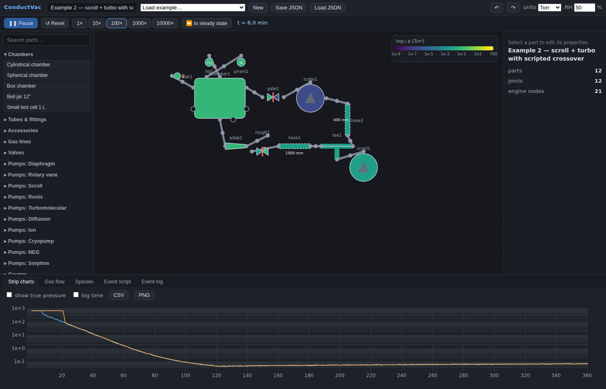
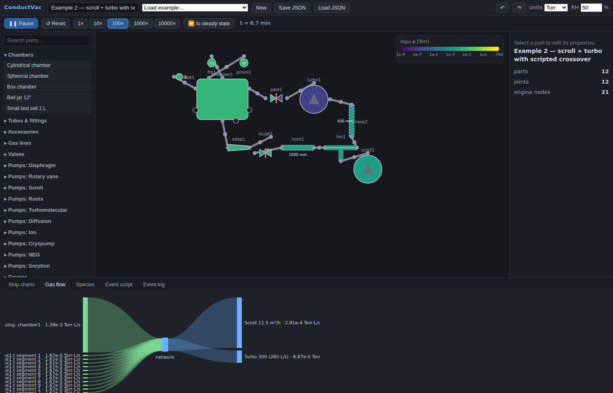

# ConductVac — Vacuum System Builder & Pump-Down Simulator

Build an arbitrary vacuum system from a parts library (chambers, tubes, fittings, valves, pumps, gauges, leaks) and simulate its pressure evolution from atmosphere to UHV with physically correct, regime-aware gas dynamics — fully client-side, in your browser.

- **Live pressure colormap** over the schematic (12 decades, viridis), including gradients *along* plumbing (tubes auto-segment internally).
- **Gauges that lie realistically**: gas-species sensitivity, response lag, noise, Pirani flatline, cold-cathode strike failures, hot-cathode filament trips, X-ray limit.
- **Strip charts** (log-p vs t or log-t) with a dashed *true pressure* overlay — watch your gauges deceive you.
- **Gas-load flow view**: sources (leaks, outgassing, permeation) → network → pumps, in Torr·L/s. Answers "what limits my base pressure."
- **Timeline event scripting** plus live interaction (double-click valves, pumps and cold traps while running).
- Multi-species (air, H₂O, H₂, He by default; gas-admittance valves auto-activate their gas, e.g. N₂/Ar backfill), He spray on leaks, bakeout (global or per-part), gas ballast, capacity-limited capture pumps.
- **Chamber payloads**: metal masses, porous graphite blocks, cable bundles (length × Ø × insulation), polymer/ceramic parts. Surface area drives outgassing; volume is subtracted from the chamber's free volume (gas displacement) — a big copper block pumps down faster but a graphite block outgasses for hours.
- **LN₂ cold traps**: in-chamber Meissner coil (pumps H₂O near the impingement rate, CO₂ slower, nothing with a high 77 K vapor pressure) and a right-angle foreline trap (elbow ×0.4 conductance + cold H₂O pumping).

Everything runs in a Web Worker; nothing leaves your machine. Save/load systems as JSON.





## Quick start

```bash
npm install
npm run dev        # development server
npm test           # engine validation suite (§ Physics below)
npm run build      # static production build in dist/
```

Load an example from the header dropdown (the scroll + turbo crossover is a good first tour), press **Run**, and raise the speed. Double-click the gate valve mid-rough-down to see why crossover discipline matters.

## Building systems

- Click a part in the palette, then click the canvas to place it (shift-click keeps placing).
- Click two ports to connect them (or drop a part so its port lands on a compatible one). Port tooltips show the flange standard; mismatched flanges still join with a warning — insert an **Adapter/reducer** part for a proper joint.
- Click a joint dot to add a KF mesh-screen centering ring (×0.7 transmission); shift-click disconnects.
- Select a part to edit its parameters; `R` rotates, `Delete` removes, `Ctrl+Z` undoes.
- Elastomer-sealed joints automatically contribute their wetted Viton area (outgassing **and** He/H₂O permeation).
- Tube physics follows the *length property*, not the drawn length.

---

## Physics

The system is a lumped-element network: nodes carry volume and per-species pressure; edges carry conductance; pumps and gas loads attach to nodes. For each node *i* and species *g*:

```
V_i · dp_ig/dt = Σ_j C_ij,g(p̄) · (p_jg − p_ig) + Q_leak + Q_outgas(t) + Q_permeation − S_ig(p) · p_ig
```

Units: Torr, liters, L/s, Torr·L/s, seconds (converted only at the display layer).

### Conductance (regime-aware, per edge, per species)

Air at 20 °C through a circular tube (d, L in cm, p̄ in Torr, C in L/s):

| Regime | Formula |
|---|---|
| Viscous (Poiseuille) | C_visc = 180 · d⁴/L · p̄ |
| Molecular (long tube) | C_mol = 12.1 · d³/L |
| Molecular aperture | C_ap = 11.6 · A  (A in cm²) |
| Knudsen interpolation | C = C_visc + Z·C_mol, Z = (1 + 2.507·(d/2λ)) / (1 + 3.095·(d/2λ)) |
| Mean free path | λ [cm] ≈ 5.0×10⁻³ / p̄ [Torr] |

Sources: Roth, *Vacuum Technology*; O'Hanlon, *A User's Guide to Vacuum Technology*; Dushman, *Scientific Foundations of Vacuum Technique*.

- **Short-tube correction** (every fitting): 1/C_mol,short = 1/C_ap + 1/C_mol,long — the Dushman approximation, good to ~10% versus Clausing factors.
- **Bends**: +1.33·d equivalent length per 90° bend. **Corrugated hose**: geometric length ×1.4 at the corrugation-root ID. **Bellows**: ×1.2.
- **Species scaling**: molecular terms × √(28.97/M); viscous terms × (μ_air/μ_gas). The Knudsen number uses the air mean free path at the total mean pressure (mixture approximation).
- **Tube auto-segmentation**: anything longer than 15 cm splits into ≤10 cm segments with internal volume and wall area — this is what makes pressure gradients along forelines visible in the colormap (capped ~2000 nodes).

### Pumps

- **Positive displacement** (diaphragm, rotary vane, scroll): S = S_peak·(1 − p_ult/p)₊ with a smoothed clip; gas ballast raises p_ult ×10 for H₂O and ×2 otherwise.
- **Roots**: compression-ratio-limited against its backing pressure; speed collapses when ΔP exceeds the rating.
- **Turbomolecular / diffusion**: throughput per species Q = A_g·(p_in,g − p_back,g/K0_g)₊ with species-dependent zero-flow compression K0 (K0(N₂) ~ 10⁸–10⁹, K0(H₂) ~ 10³–10⁴), smooth throughput rolloff above ~10⁻² Torr inlet, hard cutoff above the critical backing pressure, and first-order spin-up/warm-up. **H₂ dominating a baked system and turbos stalling on failed backing emerge from the model** rather than being scripted.
- **Ion**: bell-shaped S(p) peaking at 10⁻⁶ Torr (50% at 10⁻⁸/10⁻⁴), refuses to start above 10⁻⁴ Torr, noble-gas speed 5% (diode) / 25% (noble diode), overpressure trip.
- **Cryopump**: per-species speeds (H₂O ≈ 3× N₂), finite per-species capacity in Torr·L with saturation events, early-crossover warning above 50 mTorr.
- **NEG**: pumps H₂/H₂O/N₂/O₂/CO, nothing noble, finite capacity. **Sorption**: capacity-limited roughing.

### Gas loads

- **Leaks**: fixed-conductance orifice from a 760 Torr atmosphere node; species arrive in proportion to their atmospheric partials scaled by √(28.97/M). Sprayable with helium (dwell-limited) for leak checking.
- **Virtual leak**: a trapped cm³ at atmosphere bleeding through ~10⁻⁶ L/s — the classic slow-bleed signature He spraying cannot find.
- **Outgassing**: Q = q₁·A·(t₁/(t+t₀))ⁿ per wetted surface with per-node exposure clocks (venting above 100 Torr resets them), t₁ = 1 h, t₀ = 60 s. Unbaked metals emit mostly H₂O; a completed bake permanently divides the H₂O term by 100 and switches to the material's (constant) H₂ rate. During a bake the rate multiplies by 10^((T−20 °C)/60) — a documented stand-in for Arrhenius behavior.
- **Permeation**: constant He and H₂O influx through elastomer seal area (K ≈ 10⁻⁹ Torr·L/s/cm²) — the real floor of O-ring systems.

**Outgassing rates are order-of-magnitude, surface-history-dependent quantities.** Values follow O'Hanlon, *A User's Guide to Vacuum Technology* (outgassing chapter and appendices); Pfeiffer Vacuum, *The Vacuum Technology Book / Know-How*; Leybold, *Fundamentals of Vacuum Technology*.

### Gauges

| Gauge | Range (Torr) | Modeled behavior |
|---|---|---|
| Bourdon/piezo | 760 → 1 | gas independent, ±1 Torr noise |
| Capacitance manometer | FS → 10⁻⁴·FS | gas independent, 0.25% of reading, zero drift |
| Thermocouple | 2 → 10⁻³ | gas correction factors, sluggish (τ = 2 s) |
| Pirani | 100 → 10⁻⁴ | gas factors, flatlines below 10⁻⁴, pegs at ATM |
| Cold cathode | 10⁻² → 10⁻⁹ | strike delay ≤10 s below 10⁻⁶ (sometimes fails), ×2 accuracy, gas sensitivity |
| Hot cathode (BA) | 10⁻⁴ → 10⁻¹¹ | filament trip above 10⁻⁴, sensitivity (He 0.18, Ar 1.3, H₂ 0.46), X-ray limit 5×10⁻¹² |
| Full-range | 760 → 10⁻⁹ | Pirani+CC stitch with a visible handoff artifact near 10⁻² |

### Numerical method

The ODE system is stiff (time constants from ~0.1 ms to hours). The solver:

- integrates **u = ln p** per node per species (positivity across 12 decades; pure exponential decay is reproduced *exactly* at any step size);
- **backward Euler with Newton iteration**; the Jacobian has graph-Laplacian structure plus 2×2 pump inlet↔backing blocks, assembled banded after reverse Cuthill-McKee ordering and factorized without pivoting (with row equilibration — pressures spanning ~19 decades otherwise overflow the elimination);
- solves each species' network independently per step (conductances couple nodes, not species); everything depending on *total* pressure — Knudsen conductances, pump rolloff/critical-backing/ultimate factors — is frozen and refreshed in a damped outer iteration;
- adapts the timestep from 1 ms (after events) by ×1.5 growth / ×4 shrink between a BDF-style local error estimate, capped at 10 s live (1 h in fast-forward);
- stops **exactly** at scripted/interactive events, applies them, and restarts small;
- runs in a Web Worker, posting ~10 Hz snapshots; chart samples are recorded per solver step (decimated), so transients stay resolved at any sim speed.

**Validation suite** (`src/engine/tests/validation.test.ts`, `npm test`):

1. Single volume + fixed-S pump ⇒ p₀·e^(−St/V) within 0.5% over 6 decades
2. Two volumes through a conductance ⇒ analytic two-exponential solution
3. Conductance-limited pumping ⇒ 1/S_eff = 1/S + 1/C
4. Long-tube molecular conductance ⇒ 12.1·d³/L within 1%
5. Viscous rough-down ⇒ quasi-static Poiseuille solution
6. Outgassing-dominated steady state ⇒ p_ss = Q/S_eff
7. Stiffness: 0.05 L node between a 300 L/s pump and 100 L chamber, accurate at dt ≫ V/C

Plus integration tests on every bundled example (crossover shape, permeation floor, post-bake H₂ dominance at ~10⁻¹⁰, virtual-leak signature, Pirani-vs-full-range divergence).

---

## Model fidelity & limitations

Representative, not manufacturer data — pump curves, gauge factors and outgassing rates are class-typical values for teaching and system-level trend analysis. Known simplifications (also surfaced as ⓘ notes in the inspector):

- Short-tube conductances use the Dushman series approximation (~10% vs Clausing); series chains of fittings double-count entrance effects (10–20% conservative). No beaming corrections.
- Aperture conductance in the continuum limit uses a choked-orifice value (conservative at small pressure ratios).
- Viscous flow of mixtures is treated per-species (no advective coupling).
- An overloaded (rolled-off) turbo keeps 0.2% of its speed so overload stalls recover once the inlet drops — real pumps trip on temperature/current instead.
- Bakeout is a permanent ×100 H₂O reduction plus the tabulated H₂ rate — real bake quality varies; venting a baked system does not fully restore the unbaked state here.
- Positive-displacement pumps are assumed to hold vacuum when off (check valve); spin-up/down is a first-order lag with S ∝ rotor speed.
- Atmospheric H₂O follows 17.5 Torr saturation at 20 °C × RH; adsorbed-water outgassing scales with RH/50%.
- No thermal transients (gas at 20 °C throughout), no turbo venting dynamics, no oil vapor transport (backstreaming is an event-log warning).

## Repository layout

```
src/engine     pure TS physics core (zero React imports) + worker + tests
src/data       gases, materials, flanges, fittings/parts, pumps, gauges
src/compile.ts part-graph → engine-network compiler (union-find joints, seals)
src/ui         builder, inspector, controls, charts, colormap, sankey
src/examples   bundled example systems (integration-test fixtures)
scripts        browser smoke test (node scripts/smoke.mjs after a build)
```

## Deploy

Pushes to `main` build and publish to GitHub Pages via `.github/workflows/deploy.yml` (Vite `base: './'` keeps the bundle relocatable). Any static file host works: `npm run build` and serve `dist/`.

## References

- J. F. O'Hanlon, *A User's Guide to Vacuum Technology*, 3rd ed., Wiley.
- Pfeiffer Vacuum, *The Vacuum Technology Book* / *Vacuum Technology Know-How*.
- Leybold, *Fundamentals of Vacuum Technology*.
- A. Roth, *Vacuum Technology*, 3rd ed., North-Holland.
- S. Dushman, *Scientific Foundations of Vacuum Technique*, 2nd ed., Wiley.
